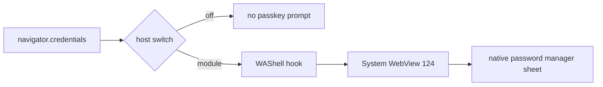

<div align="center">

# 🔑 WebAuthn for WebView Shells

**Enable passkeys in lightweight WebView-based browsers — via the *official* androidx.webkit switch, flipped from the inside.**

[](LICENSE)
[](https://github.com/LSPosed/LSPosed)


[English](README.md) · [简体中文](README.zh-CN.md)

</div>

---

## 🧠 What this actually is

Passkeys are already inside Android's **system WebView**. The official guideline says every host app that embeds a WebView must opt in itself:

```java
WebSettingsCompat.setWebAuthenticationSupport(settings, WEB_AUTHENTICATION_SUPPORT_FOR_APP);
```

Lightweight "shell" browsers (Via, Quark, X, and dozens more) render every page through the system WebView — but **none of them make this call**, so `navigator.credentials()` never reaches the credential stack. The capability is already there; the switch is simply never flipped.

**This module flips it, without touching native app code.** It is a small LSPosed module that hooks `WebView` construction inside target browsers and applies the official integration on their behalf, backed by its own copy of `androidx.webkit`.

> No patching of the system password manager · no network I/O · no UI injection.
> **Revert = flip the module off in LSPosed. That's it.**

## ✅ What you get



- Your website now realizes the phone has a platform authenticator.
- Creating and verifying passkeys goes through the **native password manager** (ColorOS 密码本, One UI Passcodes, Google Password Manager…)
- The module keeps gluing itself back on whenever the host re-touches its settings.

## 🧱 Tech stack

| Layer | What | Why |
| --- | --- | --- |
| Hook runtime | **Xposed API 93 / [LSPosed](https://github.com/LSPosed/LSPosed)** | injects into the browser's own process; module off = stock behavior |
| Bridge | **androidx.webkit 1.17** (`WebSettingsCompat.setWebAuthenticationSupport`) | the official WebView ↔ Credential-Manager integration; shipped inside the module dex |
| Target floor | **Android 7.0+ (API 24), System WebView 124+** | device must already carry WebAuthn-capable WebView; module enables, never backports |
| Build | **javac → d8 → aapt2 → apksigner** (plain PowerShell, no Gradle) | ~350 lines total; everything reproducible from one script |
| Depends on nothing else | no network, no UI, no system writes | reversibility is the design constraint |

> Why ship our own androidx.webkit? Because the shells never bundle it — the hook must supply the bridge library it is applying.

## 📦 Shell support

| Browser | Status |
| --- | --- |
| **Via GP** (`mark.via.gp` 7.3.3) | ✅ tested — passkey **create + verify** work with the native password manager |
| **Via CN** (`mark.via`) | wired & installed by default; needs nothing but your own test |
| *Everything else* | ⚠️ supports this mechanism (WebView ≥ 124), but **not wired by default** — add the package name to `TARGETS` in [`MainHook.java`](src/io/github/cmyfqwq/webauthnshell/MainHook.java), rebuild, and try it out |

## 🚀 Install

1. Requires: **rooted device + LSPosed**, Android 7.0+, system WebView **124+**
2. Download the APK from [Releases](../../releases), install it
3. Enable the module in **LSPosed Manager** (scope is pre-filled from the manifest) and restart your browser
4. Open any passkey-capable site and watch the system sheet appear

**This module is fully reversible** — turn it off or `pm uninstall io.github.cmyfqwq.webauthnshell`; everything returns to stock with no residue.

## 🔨 Build it yourself

No Gradle needed — a plain PowerShell script drives `javac → d8 → aapt2 → apksigner` from any Android SDK:

```powershell
pwsh build.ps1   # → build/WebAuthn-Shell-1.0.0.apk
```

Want another browser? Add its package to `TARGETS` in
[`MainHook.java`](src/io/github/cmyfqwq/webauthnshell/MainHook.java) and rebuild.

## 🧭 FAQ

**Is this an exploit?**
No. It sets a public (androidx) setting inside the target app's own process — exactly what the shell could call itself. Nothing is added to a WebView it cannot already do, and system WebView gatekeepers stay untouched.

**Why not ask the browsers upstream?**
Please do — a 3-line change in each browser would obsolete this module, which is the ideal outcome. This module exists to close the gap until then.

## ☕ Credits

- Built on the official [`androidx.webkit`](https://developer.android.com/identity/sign-in/credential-manager-webview) WebView–Credential-Manager bridge
- Problem coverage gathered from the [caniuse passkey matrix](https://caniuse.com/passkeys) (QQ 14.9 / Baidu 13.52 unsupported) and in-app-shell breakage reported upstream, e.g. [openai/codex #31204](https://github.com/openai/codex/issues/31204)

<div align="center">

**:fox:')
built by [cmyfqwq](https://github.com/cmyfqwq) · MIT · no tracking, no network, one switch**

</div>
