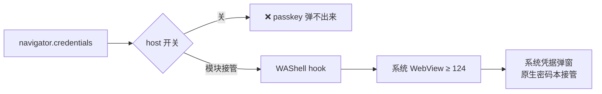

<div align="center">

# 🔑 WebAuthn for WebView Shells

**让轻量 WebView 壳浏览器用上通行密钥——拨的只是官方本来就有的那个开关。**

[](LICENSE)
[](https://github.com/LSPosed/LSPosed)


[English](README.md) · **简体中文**

</div>

---

## 🧠 这到底是什么

通行密钥的能力**本来就在 Android 系统 WebView 里**（v124+）。官方规范要求：每个内嵌 WebView 的宿主 app 都必须自己声明这一行：

```java
WebSettingsCompat.setWebAuthenticationSupport(settings, WEB_AUTHENTICATION_SUPPORT_FOR_APP);
```

Via、夸克这类轻量"壳"浏览器全部走系统 WebView 渲染页面——但**没有一家调用这行**，于是 `navigator.credentials()` 根本到不了系统凭据栈：不是系统不支持，是壳没伸手喵。

**本模块就是替它拨这根官方开关，不碰宿主代码。** 一个很小的 LSPosed 模块，hook 目标浏览器进程里的 `WebView` 构造，替宿主完成官方集成，自带一份 `androidx.webkit` 库。

> 不碰系统密码本 · 不发任何网络请求 · 不注入任何 UI。
> **回滚 = LSPosed 里关掉开关。就这么简单。**

## ✅ 效果



- 网站立刻能识别"这台手机有平台认证器"喵
- 创建/验证通行密钥全走**原生密码本**（ColorOS 密码本、谷歌密码管理工具等）
- 宿主重新改设置时模块会自动把开关粘回去

## 📦 壳浏览器支持

| 浏览器 | 状态 |
| --- | --- |
| **Via GP**（`mark.via.gp` 7.3.3） | ✅ 已实测——创建 + 验证全程正常 |
| **Via 国行**（`mark.via`） | 默认接线，等实测反馈喵 |
| *其他所有壳* | ⚠️ 机制适用（WebView ≥ 124），但**默认未接线**——把包名加进 [`MainHook.java`](src/io/github/cmyfqwq/webauthnshell/MainHook.java) 的 `TARGETS`，重新构建即可 |

## 🧱 技术堆栈

| 层 | 用什么 | 为什么 |
| --- | --- | --- |
| Hook 运行时 | **Xposed API 93 / [LSPosed](https://github.com/LSPosed/LSPosed)** | 注入进浏览器自身进程；关模块 = 原生行为 |
| 桥接 | **androidx.webkit 1.17**（`WebSettingsCompat.setWebAuthenticationSupport`） | 官方 WebView ↔ Credential Manager 集成，随模块 dex 自带 |
| 目标底线 | **Android 7.0+（API 24）/ 系统 WebView 124+** | 启用现成能力，不回填 |
| 构建 | **javac → d8 → aapt2 → apksigner**（纯 PowerShell，无 Gradle） | 约 350 行总量，一条脚本可复现 |
| 依赖广度 | 无网络、无 UI、无系统写入 | 可逆性就是设计约束喵 |

> 为什么要自带 androidx.webkit？因为壳们从来不带它——hook 必须供得起自己要应用的桥喵。

## 🚀 安装

1. 前提：**root + LSPosed**，Android 7.0+，系统 WebView **124+**
2. 从 [Releases](../../releases) 下载 APK 安装
3. LSPosed 管理器里启用模块（作用域已按 manifest 预填），重启浏览器
4. 打开任意支持 passkey 的网站，等系统凭据弹窗冒出来喵

**完全可逆**：关掉开关或 `pm uninstall io.github.cmyfqwq.webauthnshell`，一切恢复原生，零残留。

## 🔨 自己构建

不需要 Gradle——一条 PowerShell 脚本驱动 `javac → d8 → aapt2 → apksigner`：

```powershell
pwsh build.ps1   # → build/WebAuthn-Shell-1.0.0.apk
```

想加浏览器？改 [`MainHook.java`](src/io/github/cmyfqwq/webauthnshell/MainHook.java) 里的 `TARGETS` 加包名，重建喵。

## 🧭 FAQ

**这算漏洞利用吗？**
不算喵。它只是在目标 app 自己的进程里设置一个公开的（androidx）配置——壳浏览器自己本来就该调这行。没有加任何 WebView 做不到的事，系统侧的守门逻辑原封不动。

**为什么不直接找浏览器官方？**
请务必去提喵——每个浏览器加 3 行原生就好了，那是本模块最理想的下场。这个模块的存在就是为了在官方补齐之前先把洞堵上。

## ☕ Credits

- 基于 [`androidx.webkit`](https://developer.android.com/identity/sign-in/credential-manager-webview) 的 WebView–Credential Manager 官方桥接
- 问题情报来自 [caniuse passkey 支持矩阵](https://caniuse.com/passkeys)（QQ 14.9 / 百度 13.52 不支持）和上游壳浏览器翻车报告（如 [openai/codex #31204](https://github.com/openai/codex/issues/31204)）

<div align="center">

**MIT · 无追踪 · 无联网 · 一个开关**

[cmyfqwq](https://github.com/cmyfqwq) 出品

</div>
